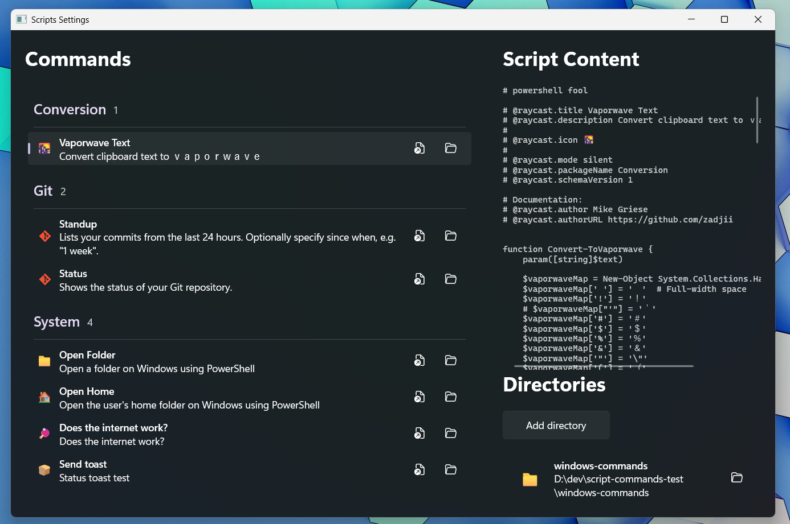

# Scripts for Command Palette

This is an extension for the Command Palette that allows you to use your [script
commands from Raycast](https://github.com/raycast/script-commands) in the
[Command
Palette](https://github.com/microsoft/powertoys/tree/master/src/modules/cmdpal).

It comes with a handy UI for adding folders of script commands, and viewing the
details of those commands.

## Installation

Grab it off the [Releases page](https://github.com/zadjii/ScriptsExtensions/releases).

## Usage

For more details, refer to the docs for Raycast's [Script
Commands](https://github.com/raycast/script-commands). In general, properties
work the same.

However, currently (v0.0.2) only supports scripts authored in PowerShell. There
are a couple examples in [`./commands/`](./commands/) of doing some simple
things.

Most Raycast scripts use `pbcopy` and `pbpaste` to copy and paste data. In
PowerShell, you can use `Set-Clipboard` and `Get-Clipboard` instead. 

## Contributing

If you want to contribute, please open an issue or a pull request. Just go for
it. Big things than need work:

* Expanding support for other scripting languages beyond PowerShell.
* Adding support for script parameters
  * These need to use a `FormContent` on a `ContentPage` until
    [microsoft/PowerToys#40948](https://github.com/microsoft/PowerToys/issues/40948)
    is implemented.
* Porting more of the Raycast script commands to Windows (and/or PowerShell).
* Improving the UI for adding and managing script commands.
  * Add a search bar to filter commands.
  * Clean up that titlebar and script preview area.